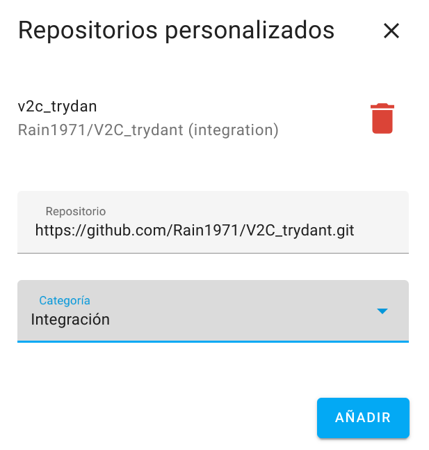
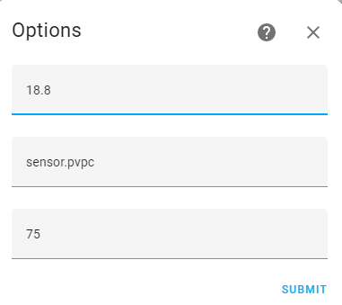
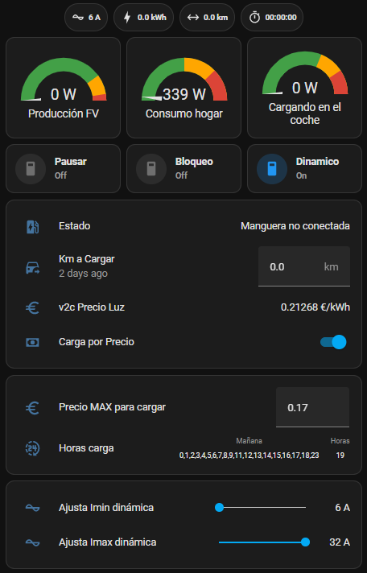

# CARGADOR DE COCHE V2C TRYDAN para HOME ASSISTANT

[](https://github.com/hacs/integration)
[](https://GitHub.com//Rain1971/V2C_trydant/releases/)
[](https://github.com/Rain1971/V2C_trydant/blob/main/README.md)
[](https://github.com/Rain1971/V2C_trydant/blob/main/README.es.md)

Esta integración expone la información y funciones disponibles en [V2C trydan](https://v2charge.com/trydan/) directamente a través de la interfaz http en Home Assistant.

# Prerequisitos:

Esta integración soporta la conexión de red a V2C trydan directamente, por lo que toma nota de la dirección IP estática de V2C trydan previamente.

Para una configuración posterior, necesitarás conocer los datos de consumo eléctrico de tu coche expresados en Kwh por 100 km

Si quieres usar la función de control de carga basada en el precio, debes instalar las siguientes integraciones para lovelace, desde HACS:
- [PVPC Hourly Pricing Card](https://github.com/danimart1991/pvpc-hourly-pricing-card) 
- [multiple-entity-row](https://github.com/benct/lovelace-multiple-entity-row)

# Instalación:

* Añade este repositorio en HACS ( [https://github.com/Rain1971/V2C_trydant.git](https://github.com/Rain1971/V2C_trydant.git) )


* Reinicia Home Assistant
* Ve a Configuración -> Integraciones -> Añadir Integración


* Añade la integración y pon la IP de tu dispositivo
* Ve a la integración de V2C. Ahota hay 28 entidades. Pulsa en ajustes y configura:
   - Kwh x 100Km de tu coche (por defecto: 22)
   - Sensor.pvpc  ->( añade esto solo si quieres controlar la carga de tu coche en función del precio de la electricidad. Ver PVPC Hourly Pricing Card )
   
* Pulsa 'Enviar' y se creará una nueva entidad: sensor.v2c_precio_luz. Ahora hay 29 entidades.
* Reinicia Home Assistant
# Entities:

Se crean las siguientes entidades:

| Name                               | Type    | R/W  | Units        | Description                                    |
| :--------------------------------- | :------ | :--- | :----------- | :--------------------------------------------- |
| v2c_trydan_sensor_chargeenergy     | Sensor | R   | N kWh      | Energía cargada en la sesión en kWh.        
| v2c_trydan_sensor_chargekm  v2c_km_to_charge        | Sensor Number   | R \ W | N km     | Cantidad de Km cargados en la sesión en Km.
| v2c_trydan_sensor_chargepower      | Sensor | R   | N W        | Potencia de carga atual en Watts.
| v2c_trydan_sensor_chargestate      | Sensor | R   | S `values`    | Estado de la carga en texto: `Manguera no conectada`, `Manguera conectada (NO CARGA)`,`Manguera conectada (CARGANDO)`
| v2c_trydan_numericalstatus         | Sensor | R   | N `values`    | Estado de la carga. En numero: `0`-Hose Not connected, `1`-Hose Connected (BUT NOT CHARGING),`2`-Hose Connected (CHARGING)
| v2c_trydan_sensor_chargetime       | Sensor | R   | N s        | Tiempo desde que se conecto la manguera. 
| v2c_trydan_sensor_contractedpower  | Sensor | R   | N W        | Potencia contratada Watts. Por defecto `-1`
| vc2_trydan_sensor_dynamic          | Sensor | R   | N `values`    | Control de corriente dinámico: `0`-Desactivado, `1`-Activo
| vc2_trydan_sensor_dynamicpowermode | Sensor | R   | N `values`    | Modo Dynamico: 0 Timed Power enabled; `1`-Timed Power Disabled, `2`-Timed Power Disabled and Exclusive Mode setted, `3`-Timed Power Disabled and Min Power Mode setted, `4`-Timed Power Disabled and Grid+FV mode setted, `5`-Timed Power Disabled and Stop Mode setted
| vc2_trydan_sensor_fvpower          | Sensor | R   | N W        | Generacion fotovoltaica en [w].
| vc2_trydan_sensor_housepower       | Sensor | R   | N W        | Consumo total de casa en [w].
| v2c_trydan_sensor_intensity \   v2c_intensity      | Sensor Number | R \ W | N A        | Intensity offered by Charge Point in Amps, **if Dynamic Charge is disabled**. 
| v2c_trydan_sensor_locked           | Sensor | R   | N `values`    | Bloquear el punto de carga: `0`-Activo, `1`-Desactivado 
| v2c_trydan_sensor_maxintensity  v2c_max_intensity   | Sensor Number   | R \ W | N A        | Corriente máxima en amperios [A], **Solo si carga dinámica está activa**. (por defecto 32A)
| v2c_trydan_sensor_minintensity  v2c_min_intensity     | Sensor Number | R \ W | N A        | Corriente mínima en amperios [A], **Solo si carga dinámica está activa**. (por defecto 6A)
| v2c_trydan_sensor_paused           | Sensor | R   | N `values`    | Estado de la pausa: `0`-Enabled, `1`-Disabled                
| v2c_trydan_sensor_pausedynamic     | Sensor | R   | N `values`    | Estado de la carga dinámica: `0`-Modulando, `1`-No Modulando
| v2c_trydan_sensor_slaveerror       | Sensor | R   | N `values`    | Estado comunicacion con esclavo: `0`-Sin error, `1`-Mensaje erroneo, `2`-Error de comunicación
| v2c_trydan_sensor_timer            | Sensor | R   | N `values`    | Sensor de tiempo de carga: `1`-Timer Activo, `0`-Timer Parado
| v2c_precio_luz                     | Sensor | R   | state `attributes` | Datos tomados api.esios.ree.es por REE. El `state` contiene el precio actual y los atributos: `state_class`, `measurement`, `tariff`, `period`, `available_power`, `next_period`, `hours_to_next_period`, `next_better_price`, `hours_to_better_price`,  `num_better_prices_ahead`, `price_position`, `price_ratio`, `max_price`, `max_price_at`, `min_price`, `min_price_at`, `next_best_at`, `price_00h` to `price_23h`, `unit_of_measurement`, `attribution`, `icon`, `friendly_name`, `ValidHours` (muestra a que horas cargará hoy si limitamos con este precio), `ValidHoursNextDay` (muestra a que horas cargará mañana si limitamos con este precio) and `TotalHours` (muestra el total de horas que cargará si limitamos con este precio). Estos 2 se actualiza cada 30s solo si number.v2c_maxprice > 0 
| vc2_trydan_switch_dynamic          | Switch | R/W | `on` `off`    | Interruptor de carga dinamica. Por defecto `off`                       
| v2c_trydan_switch_paused           | Switch | R/W | `on` `off`    | Interruptor de pausa. Por defecto `off`                        
| v2c_trydan_switch_locked           | Switch | R/W | `on` `off`    | Interruptor de bloqueo. Por defecto `off`
| v2c_trydan_switch_v2c_carga_pvpc   | Switch | R/W | `on` `off`    | Interruptor de para hacer la carga a un precio máximo. Por defecto `off`


# Eventos:

Los siguientes eventos son creados:

| Event                              | Description                                   |
| :--------------------------------- |:--------------------------------------------- |
| v2c_trydan.charging_complete       | Evento que sucede si has marcado un numero total de Km a cargar y sucede cuando ha cargado. 

# Ejemplos:

* Puedes también usar una automatización para comprobar cuando el dispositivo ha cambiado el Km establecido:
```
alias: CARGA COCHE COMPLETA
description: CARGA COMPLETA
trigger:
  - platform: event
    event_type: v2c_trydan.charging_complete
action:
  - service: notify.notify
    data:
      message: La carga del vehículo ha alcanzado el límite de kilómetros.
  - service: notify.pushover
    data:
      message: KM del coche CARGADOS
      title: CARGADOR!
      data:
        priority: 1
    enabled: true
mode: single
```

# Ejemplos PANTALLA:

* Use [example.yaml](https://raw.githubusercontent.com/Rain1971/V2C_trydant/main/lovelance/example.yaml)
* For pvpc Control [example_pvpc.yaml](https://raw.githubusercontent.com/Rain1971/V2C_trydant/main/lovelance/example_pvpc.yaml)
* For pvpc Control, compacted version [example_pvpc_compact.yaml](https://raw.githubusercontent.com/Rain1971/V2C_trydant/main/lovelance/example_pvpc_compact.yaml)


